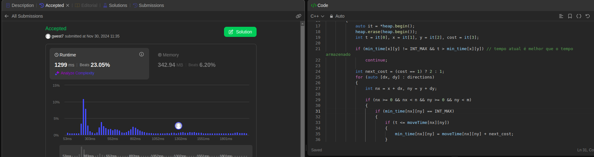
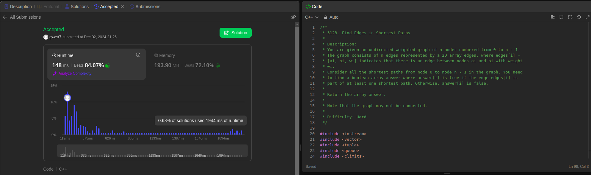
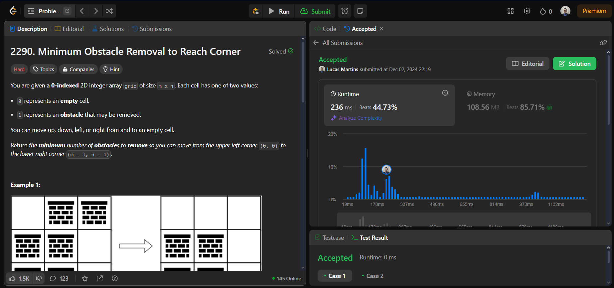

# LeetCode

**Número da Lista**: 19 
**Conteúdo da Disciplina**: Grafos 2 

## Alunos
| Matrícula | Aluno                 |
| --------- | --------------------- |
| 211061805 | Guilherme Westphall   |
| 221022088 | Lucas Martins Gabriel |

## Vídeo

[Youtube](https://youtu.be/fmxYw_m4sS4)

## Sobre 
O projeto consiste em resolver exercícios do site LeetCode, que é uma plataforma de competição de programação online que oferece desafios de programação. O objetivo é praticar e melhorar o entedenimento acerca dos algoritmos de grafos 2.

| Número | Dificuldade |
|--------|-------------|
| [3342](https://leetcode.com/problems/find-minimum-time-to-reach-last-room-ii/description/) | Média |
| [3123](https://leetcode.com/problems/find-edges-in-shortest-paths/description/) | Difícil |
| [2290](https://leetcode.com/problems/minimum-obstacle-removal-to-reach-corner/description/) | Difícil |

## Screenshots

### 3342

### 3123

### 2290

## Instalação 
**Linguagem**: C++ 

## Uso 
Para usar o projeto, basta clonar o repositório, compilar e executar o arquivo .cpp desejado.

